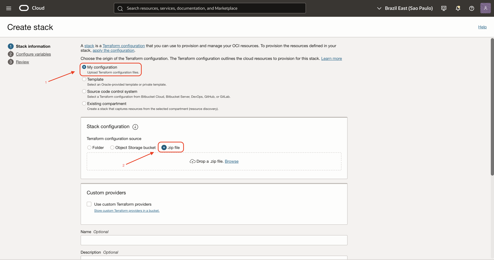

# 🚀 Integração OCI com Runflow
Este repositório contém um Lab prático de OCI, criado para demonstrar, de forma simples e progressiva, como provisionar uma máquina virtual através de um script terraform (Resource Manager) com SDK Runflow em modo self-host.

---

## 🎯 Objetivo

Ao final deste hands-on, você terá provisionado: 

- Uma VCN publica
- Uma subnet publica
- Internet Gateway, route table e security list
- Uma VM Ubuntu 22.04
- Docker e Docker Compose instalados automaticamente
- Firewall local da VM aberto para SSH, HTTP, HTTPS e porta do Runflow
- Pagina de status em `http://IP_PUBLICO`
- Porta publica do Runflow em `http://IP_PUBLICO:3000`

---

## ⚙️ Configuração

### 1. Oracle Cloud Infrastructure

1. Acesse [https://cloud.oracle.com/] e faça login
2. Acesse o canto superior direito "PROFILE" →  Identity Domain →  Compartments = "Create Compartment"
3. Após criação do Compartment, vá no menu principal no canto superior esquerdo → Developer Services → Resource Manager → Stacks → Create Stack:
    - 3.1 - 
    - 3.2 Envie o arquivo : "runflow-oci-saas-demo-v2.zip" que está nesse repositório
    - 3.3 - Create in compartment: inserir o compartment que foi criado no passo anterior
    - 3.4 - Se vocês não forem utilizar nenhuma api_key (grok ou runflow), deixar vazio esses campos
    - 3.5 - Antes de criar selecionar em "Run apply on the created stack" o checkbox "Run apply"

4. Após alguns minutos, será criado alguns recursos como:
    - Toda fundação de redes como VCN, Subnet, SL, Gateways e etc
    - VM Ubuntu Shape E5 Flex com IP Público com Node.js, nginx e runflow-ai/sdk
    - A VM contém APP, Health, Logs Bootstrap e Logs Servico, além a possibilidade de inserção de api_keys futuras

---
## 🎯  Considerações finais

Esse fluxo permitiu validar, na prática de forma simples e eficaz a criação de alguns recursos através do Resource Manager, que é um serviço Oracle que permite utilização de IaC Terraform.

---

**Profissional Oracle:** Thiago Alves Gomes
**Demo OCI com Resource Manager
**Tema:** Hackathon Runflow + Oracle Journey: Construindo Agentes de IA.

---

